## Updates Timeline

---

## 📅 2026

<strong>Click to expand 2026 updates</strong>

### April 23, 2026  

:::: {.columns}

::: {.column width="50%"}
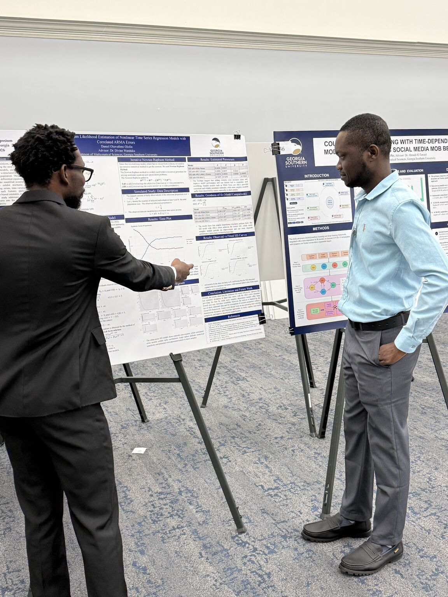{fig-align="center" width="100%"}
:::

::: {.column width="50%"}
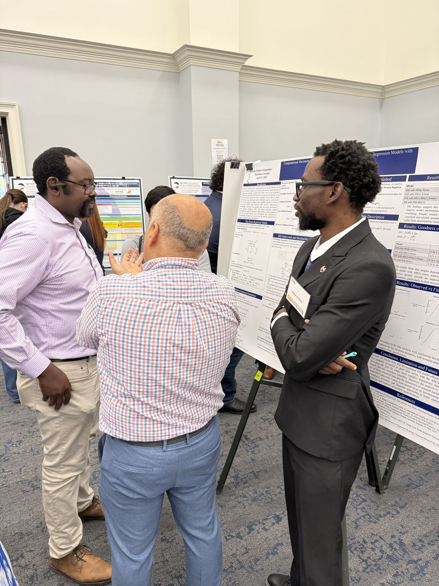{fig-align="center" width="100%"}
:::

::::

Presented *“Computational Maximum Likelihood Estimation of Nonlinear Time Series Regression Models with Correlated ARMA Errors”* at the GS4 2026 Student Scholar Symposium, Georgia Southern University.

This research developed a computational framework for nonlinear time series regression models with correlated ARMA error structures using Newton–Raphson maximum likelihood estimation. The work demonstrated improved statistical inference, parameter estimation, and predictive performance for complex time-dependent systems.

---

### April 23, 2026  
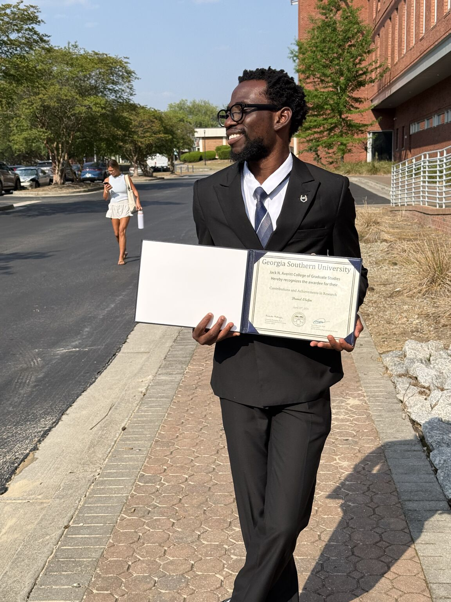{fig-align="center" width="500px"}

Nominated for the **Averitt Award: Excellence in Research**, in recognition of outstanding research contributions, methodological rigor, and impactful data-driven work. This includes quantitative analysis, reproducible research practices, interdisciplinary collaboration, conference presentations, and scholarly outputs.

---

### April 03, 2026  
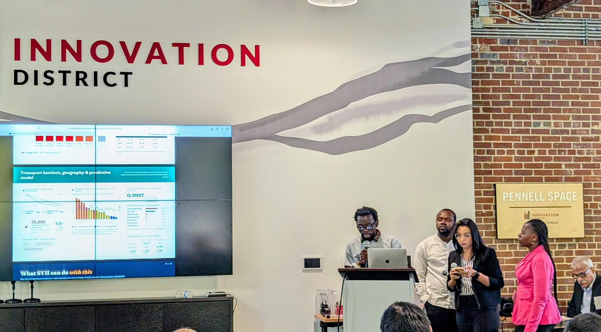{fig-align="center" width="500px"}

Represented Georgia Southern University at the **UGA ASA DataFest 2026**, collaborating on a large-scale healthcare dataset. Contributed to developing data-cleaning pipelines, patient-level analyses, and an interactive tool for tracking patient journeys and identifying gaps in care.

---

### April 03, 2026  
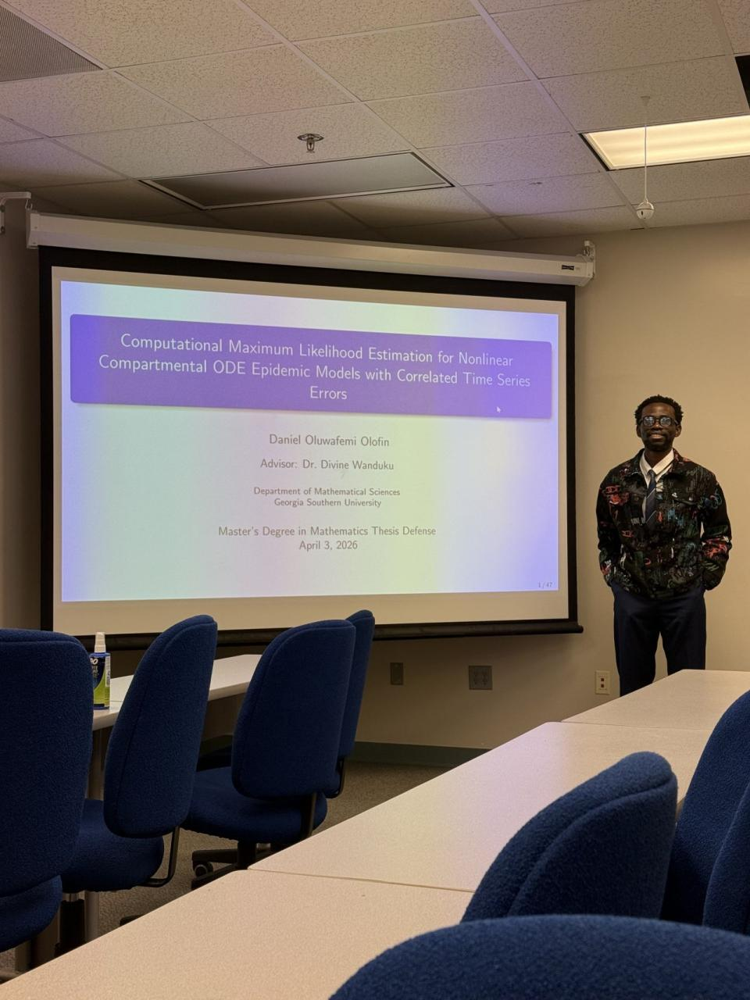{fig-align="center" width="500px"}

Successfully defended my thesis titled *“Computational Maximum Likelihood Estimation for Nonlinear Compartmental ODE Epidemic Models with Correlated Time Series Errors.”* The work developed a computational framework integrating epidemic dynamics with time-series modeling to improve infectious disease inference and prediction.

---

### March 13, 2026  
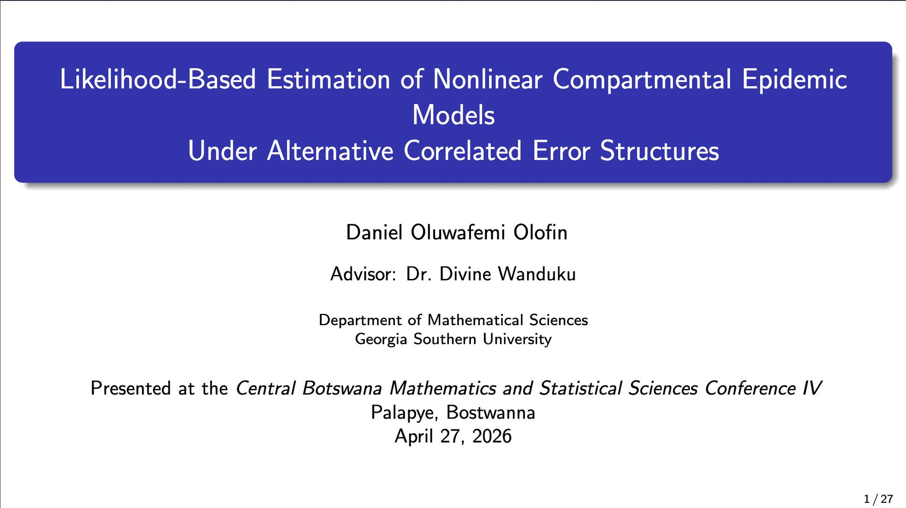{fig-align="center" width="500px"}
Presented research on *likelihood-based estimation for nonlinear epidemic compartmental models with correlated error structures (AR/ARMA)* at the Central Botswana Mathematics and Statistical Sciences Conference IV. The work demonstrated improved inference and forecasting accuracy using maximum likelihood estimation and model comparison techniques.

## 📅 2025

<strong>Click to expand 2025 updates</strong>

### August 10, 2025
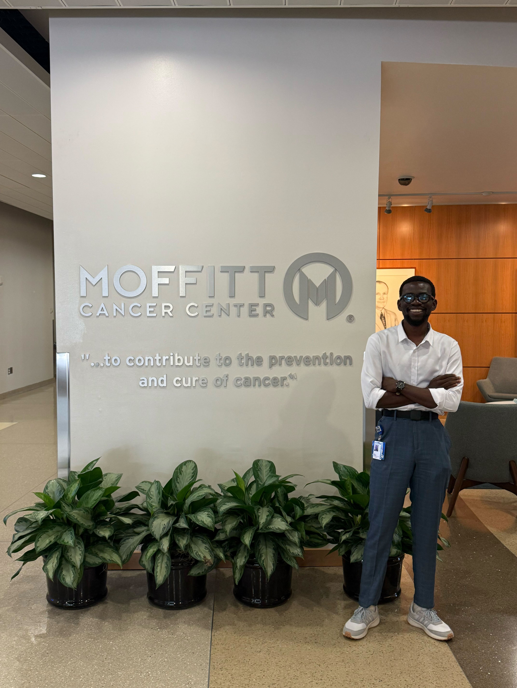{fig-align="center" width="500px"}

I am pleased to share that I have completed my research internship at the Clonal Redesign Lab, Moffitt Cancer Center. This experience allowed me to apply stochastic simulation models and advanced biostatistical methods to study chromosomal instability in cancer cell lines. It has been an incredible opportunity to grow as a researcher and contribute to impactful oncology research.

---

### July 24, 2025
I am honored to have been selected for the **Emerging Leaders in AI (ELAI) Graduate Program**, organized by Black in AI. This program will deepen my engagement with artificial intelligence and strengthen my work at the intersection of biostatistics, AI, and precision medicine.

---

### July 22, 2025
I am excited to announce my induction as an Associate Member of **Sigma Xi, The Scientific Research Honor Society**, joining a global community of researchers advancing science.

---

### June 2, 2025
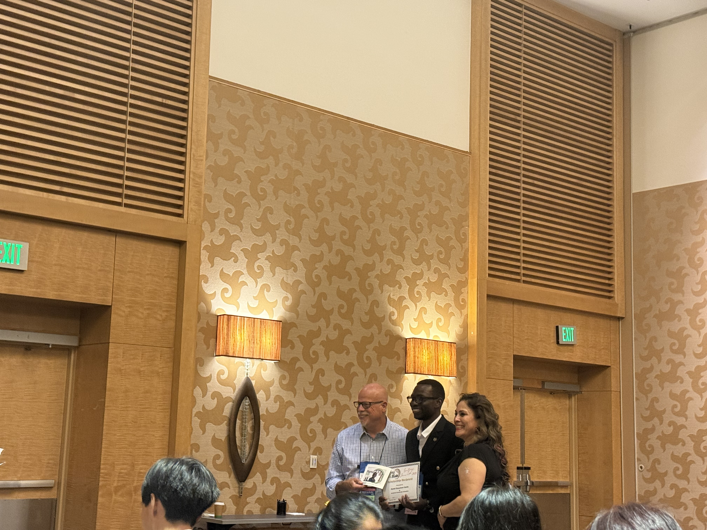{fig-align="center" width="500px"}

Received a Scholarship Award and Certificate of Achievement from PharmaSUG Conference Committee for contributions to clinical research and data science.

---

### June 1–4, 2025
{fig-align="center" width="500px"}

Attended PharmaSUG 2025 Conference as a Student Scholarship Recipient, engaging with leaders in statistical programming and clinical data science.

---

### May 21, 2025
Selected for the **Yale PATHS Program**, a 10-month competitive training program by Yale School of Medicine focused on developing future biomedical leaders.

---

### May 11, 2025
{fig-align="center" width="500px"}

Joined the Clonal Redesign Lab, Moffitt Cancer Center, as a Graduate Research Trainee working in mathematical oncology and data science.

---

### May 1, 2025
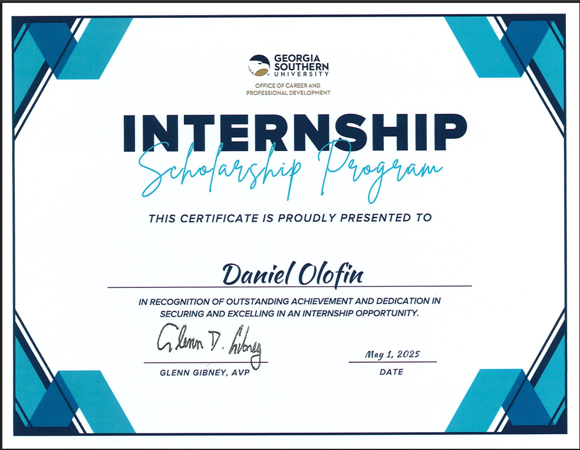{fig-align="center" width="500px"}

Received Certification of Achievement from Georgia Southern University for securing and excelling in a competitive internship.

---

### April 24, 2025
{fig-align="center" width="100%"}

Presented research on *Time Series Forecasting for HIV Prevalence using ARIMA models* at GS4 Student Scholar Symposium.

{fig-align="center" width="100%"}

Engaged with Professor Divine Wanduku during the GS4 Student Scholar Symposium.

---

### April 1, 2025
Accepted for Summer 2025 internship at Moffitt Cancer Center focusing on cancer genomics and computational oncology.

---

### February 24, 2025
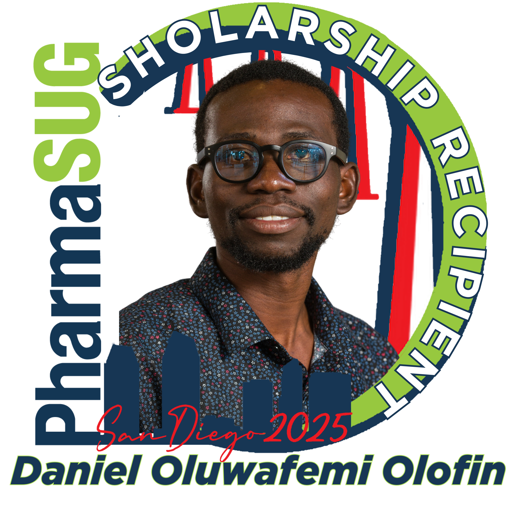{fig-align="center" width="500px"}

Selected as Student Scholar for PharmaSUG 2025 in recognition of excellence in statistical programming.

---

## 📅 2024

<strong>Click to expand 2024 updates</strong>

### October 25, 2024
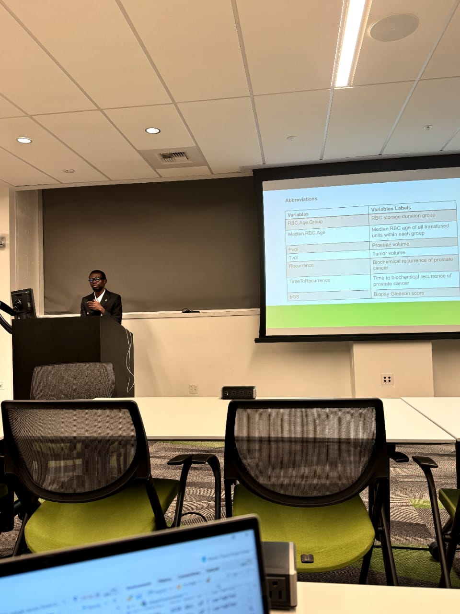{fig-align="center" width="500px"}

Presented research at Fred Hutch Cancer Center Data Science Lab during the Data Science for Environmental Health Workshop.

---

## 📅 2023

<strong>Click to expand 2023 updates</strong>

*(No entries yet — you can update as needed.)*

---

## 📅 2022

<strong>Click to expand 2022 updates</strong>

### November 18, 2022
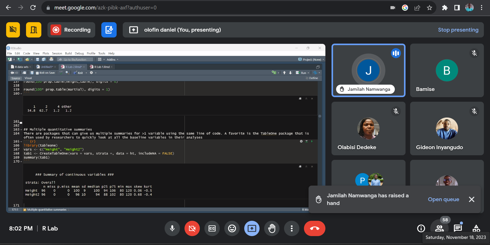{fig-align="center" width="500px"}

Delivered hands-on training in medical statistics using R programming to clinicians, researchers, and students during Stat101 organized by StatsClinic.

